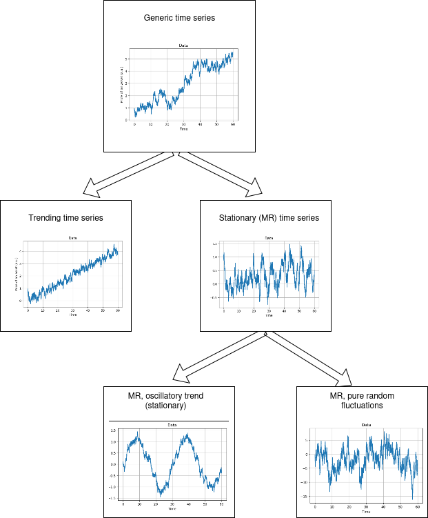

# Mean reversion metric

Mean reversion is a financial theory suggesting that asset prices and historical returns eventually revert to the long-term mean or average level of the entire dataset. This concept implies that high and low prices are temporary and that an asset's price will tend to move to the average price over time.

The goal of this project is to implement a **metric** that quantifies the degree of mean reversion of a given financial dataset. 

### Classifying the behaviour of the dataset:

Based on the temporal trend of a financial dataset, we can identify different characteristic behaviours:
1) **Trending**. A trending temporal series has a general direction in which the data points are moving over a period of time (usually a linear one). Trends are crucial for understanding the overall movement of asset prices and making informed investment decisions
2) **Stationary** (mean reverting). A process is said to be _stationary_ in a given time window if it oscillates around a fixed constant value and do not displays an evident growing trend. We can further distinguish two different extreme scenarios:
    - Mainly **random fluctuations**: the time series is stationary and its fluctuations around the average are merely stochastic short-period noisy perturbation
    - Statistically significative **oscillatory trend**: the process is still stationary but it displays an oscillatory trend that is not simply due to the random fluctuations

    

## The algorithm (WIP)

1) We first verify whether the dataset has a _clear growing or decreasing trend_ (case [1]), in which case the dataset for sure isn't mean-reverting. It could still be possible that, when substracting the global trend of the time series, what we have left is a mean-reverting process, but we haven't worked on that.
To assess the _trendness_ of a dataset, we built a function `find_trend_mean(dataset)` that performs a linear fit on the experimental points and computes the statistical fit accuracy ($R^2$). If the confidence level is high and the slope of the fit is greater (in absolute value) than a fixed threshold, thenwe can conclude that a linear trend exists and label the dataset as a non mean-reverting

2) If the dataset is stationary, we can determine whether the oscillations around the average are purely stochastic or follow a more robust oscillatory trend. We define a metric $\eta$ such that $0 < \eta < 1$ if the dataset in a given time window $[a,b]$ is stationary and:

$$
\eta =
\begin{cases}
0 & \text{ if the fluctuations are merely random and stochastic, like a white noise (case [2a])}\\
1 & \text{ if the fluctuations are due to a perfectly deterministic oscillatory trend (case [2b])}
\end{cases}
$$

3) ALGORITHM 1 (ALE): FOURIER/TIME DETECTIONS --> outputs a value of $\eta$
4) ALGORITHM 2 (LO): STATISTICAL HISTO --> outputs a value of $\eta$
5) ALGORITHM 3 (ALE): STOCHASTIC/ARM AUTOREG --> outputs a value of $\eta$
5.1) All of this algorithm can be turned into a instanteneous version? WIP

6) Financial strategy (RIC): based on the $\eta$ value, one can implement a financial strategy ...