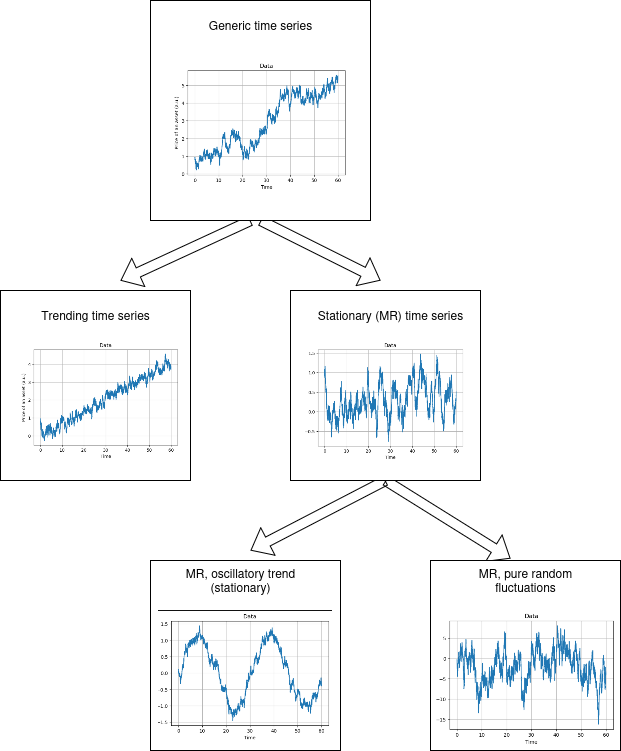

# Mean reversion metric

Mean reversion is a financial theory suggesting that asset prices and historical returns eventually revert to the long-term mean or average level of the entire dataset. This concept implies that high and low prices are temporary and that an asset's price will tend to move to the average price over time.

The goal of this project is to implement a **metric** that quantifies the degree of mean reversion of a given financial dataset. 

### Classifying the behaviour of the dataset:

Based on the temporal trend of a financial dataset, we can identify different characteristic behaviours:
1) **Trending**. A trending temporal series has a general direction in which the data points are moving over a period of time (usually a linear one). Trends are crucial for understanding the overall movement of asset prices and making informed investment decisions
2) **Stationary** (mean reverting). A process is said to be _stationary_ in a given time window if it oscillates around a fixed constant value and do not displays an evident growing trend. We can further distinguish two different extreme scenarios:
    - Mainly **random fluctuations**: the time series is stationary and its fluctuations around the average are merely stochastic short-period noisy perturbation
    - Statistically significative **oscillatory trend**: the process is still stationary but it displays an oscillatory trend that is not simply due to the random fluctuations

    

## The MR index
Let us define a metric $\eta$ such that $0 < \eta < 1$ if the dataset in a given time window $[a,b]$ is stationary and:

$$
\eta =
\begin{cases}
0 & \text{ if the fluctuations are merely random and stochastic, like a white noise (case [2a])}\\
1 & \text{ if the fluctuations are due to a perfectly deterministic oscillatory trend (case [2b])}
\end{cases}
$$

We implemented two different algorithms whose objective is to evaluate the MRI $\eta$ over a given dataframe. The first approach merges together the theory of stochastic processes with autoregressive models to extract meaningful properties of the dataset, such as its amplitude and volatility. Combining those quantities, one can obtain a first metric capable of estimating $\eta$. In the second approach, we randomly sample points from the dataset and perform some statistical computations on the their distribution. The MRI $\eta$ can then be associated to the _normality_ of the resulting distribution. 

These procedures can be easily adapted into a _rolling algorithm_, i.e. an algorithm that provides an instantaneous estimation of the MRI. Using this local information, we tried to develop a financial buying/selling strategy

## Structure of the repository
This repository is divided into different Python notebooks and files. The most important ones are:
- `MeanReversion.ipynb`: The general Python notebook where the main analysis and implementation of the mean reversion metric are presented. The called functions are not directly implemented in this notebook but are imported from an external module 
- `meanreversion.py`: A Python module that contains the actual implementation of all the functions used in this project
- `data/`: This directory contains the financial datasets used for testing and validating the algorithms.

